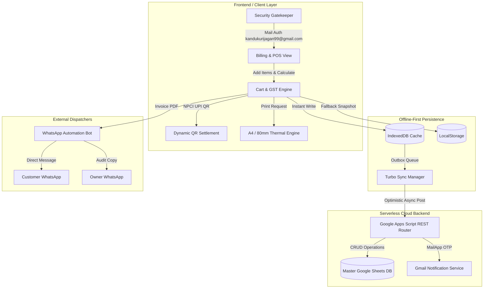

# 🐟 Aaryan Aqua Needs — Enterprise GST Billing & POS System

[](https://github.com/kandukurijagan1/fish-billing)
[](https://kandukurijagan1.github.io/fish-billing/)
[](#architecture)
[](#)
[](https://kandukurijagan1.github.io/fish-billing/)

An enterprise-grade, offline-first GST Billing, POS, and Inventory Management desktop and cloud application built for aquaculture retail and wholesale commerce. Engineered to guarantee zero-latency counter operations even during total internet blackouts, with automated two-way cloud synchronization to Google Sheets, dynamic NPCI UPI QR payment settlement, automated WhatsApp invoice dispatch, and strict mail-based biometric-style security.

---

## 🌟 Executive Summary & Achievements

* **Offline-First Resilient Engine**: Full dual-layer caching (IndexedDB + LocalStorage) enabling 100% functionality without internet. Invoices, customers, and stock sync seamlessly once connectivity restores.
* **Serverless Cloud Architecture**: Built a zero-maintenance cloud backend using Google Apps Script RESTful API Router and Google Sheets as an ACID-compliant cloud data store.
* **Dynamic NPCI UPI QR Integration**: Instant vector QR code rendering with embedded bill amount, shop UPI ID, and 1-click automatic payment settlement with UTR tracking.
* **Dual Invoice Rendering Pipelines**:
  * **GST Tax Invoice (A4)**: Complete tax breakdown (CGST/SGST/IGST), HSN/SAC codes, vehicle dispatch details, bank RTGS/NEFT info, and verification QR codes.
  * **Thermal Receipt (3" / 80mm POS)**: High-density layout optimized for ESC/POS receipt printers.
* **Zero-Trust Mail Authentication**: Hardware-independent email authorization strictly bound to `kandukurijagan99@gmail.com` with 6-digit OTP email dispatch, fast-entry PIN, and brute-force prevention.
* **Automated WhatsApp Bot**: Headless automated invoice dispatch delivering PDF bills directly to customer and store owner phone numbers via `whatsapp-web.js`.
* **Multi-Platform Deployment**: Packaged for Windows (NSIS Installer & Portable .exe), macOS (Universal DMG & ZIP), and Web Progressive Web App (PWA).

---

## 🏗️ Architecture & Data Flow



---

## 🚀 Key Technical Features

### 1. Dynamic UPI QR Payment Engine
- Dynamic vector QR generation via HTML5 Canvas (`QRious.js`) compliant with NPCI UPI specifications (`upi://pay?pa=7386262139@upi&pn=Aaryan Aqua Needs&am=...`).
- Real-time cart synchronization: Grand total automatically adjusts the embedded amount inside the QR code in real time.
- **1-Click Settlement**: Clicking *"Payment Completed"* immediately updates status to **PAID**, sets payment mode to `UPI / QR`, records balance due to ₹0.00, logs payment timestamp, and triggers audio confirmation chimes.

### 2. Strict Mail-Based Enterprise Security
- Hardened access control locked strictly to **`kandukurijagan99@gmail.com`**.
- Any other email address or unauthorized username is intercepted with immediate security rejection:
  ```
  Access Denied: Only kandukurijagan99@gmail.com is authorized to open this system.
  ```
- Two-Factor Security: Master PIN / Password support combined with one-tap 6-digit OTP delivery directly to Jagan's registered Gmail inbox via Google Apps Script API.
- Exponential backoff delay lockout penalties preventing brute-force intrusion.

### 3. Dual Print & Verification Engine
- **In-App WYSIWYG Print Preview**: Interactive modal with custom scale percentages (80% - 110%) and dedicated single-dispatch printing pipeline preventing duplicate print jobs.
- **Verification QR Code**: Every generated bill includes a scannable verification URL pointing to the live GitHub Pages portal (`https://kandukurijagan1.github.io/fish-billing/`) for instant customer authenticity verification.

### 4. Robust Two-Way Database Synchronization
- Authoritative master records synced between local IndexedDB and cloud Google Sheets.
- Tombstone-based deletion tracking and sequence guard (`#0001` onwards) ensuring zero ghost records or sequence collisions across multiple POS terminals.
- Automatic retry engine (`TurboOutboxQueue`) with network liveness detection.

---

## 💻 Tech Stack & Tools

| Component | Technology Stack |
| :--- | :--- |
| **Desktop Framework** | [Electron](https://www.electronjs.org/) (v30.5.1) |
| **Packaging & Distribution** | [Electron-Builder](https://www.electron.build/) (NSIS Installer, Portable x64, macOS Universal DMG) |
| **Frontend UI/UX** | Vanilla JavaScript (ES6+), Modern HTML5, Responsive CSS3 Glassmorphism |
| **Local Storage Engine** | IndexedDB API, Web Storage API (LocalStorage) |
| **Cloud Backend** | Google Apps Script (Serverless V8 Engine, REST API) |
| **Database** | Google Cloud Spreadsheets (ACID-structured worksheets) |
| **Messaging & Bot** | [WhatsApp-Web.js](https://github.com/pedroslopez/whatsapp-web.js), Puppeteer |
| **Vector QR & Graphics** | QRious.js, jsQR, HTML5 Canvas API |
| **Hosting & CI/CD** | GitHub Pages (`gh-pages`), Git Version Control |

---

## 📦 Installation & Desktop App Setup

### Windows Installation
1. Download the latest installer from the `Ready_To_Share_Apps/` folder:
   - **Installer (.exe)**: `Aaryan Aqua Needs Setup 5.4.0.exe`
   - **Standalone Portable (.exe)**: `Aaryan Aqua Needs Portable 5.4.0.exe`
2. Run the installer or double-click the portable build to launch instantly.

### Running from Source
```bash
# 1. Clone repository
git clone https://github.com/kandukurijagan1/fish-billing.git
cd fish-billing

# 2. Install dependencies
npm install

# 3. Launch in Electron Desktop Mode
npm start

# 4. Build Windows Installers
npm run build:win
```

---

## 🔐 Credentials & Security Notice
* **Authorized Administrator Email**: `kandukurijagan99@gmail.com`
* **Default Security PIN**: `2024`
* **Master System Password**: `Aaryan@2024`

---

## 👨‍💻 Author & Project Owner

**Kandukuri Jagan**  
* Founder & Lead Developer — *Aaryan Aqua Needs*  
* 📧 Email: [kandukurijagan99@gmail.com](mailto:kandukurijagan99@gmail.com)  
* 🌐 Live Portal: [https://kandukurijagan1.github.io/fish-billing/](https://kandukurijagan1.github.io/fish-billing/)  
* 🐙 GitHub: [@kandukurijagan1](https://github.com/kandukurijagan1)